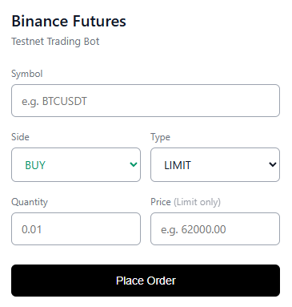

# Binance Futures Testnet Trading Bot

A minimal, high-quality, and robust Python application for placing Market and Limit orders on the Binance Futures Testnet (USDT-M). It includes dynamic exchange-rule validations, precise decimal mathematical rounding, structured file/console logging, a unit testing suite, and a lightweight local Web UI.

---

## ⚡ Quick Start

### 1. Installation
Install the minimal dependencies required to run the bot and Web UI:
```bash
pip install -r requirements.txt
```

### 2. Configure Environment
Create a `.env` file in the root directory (do not commit this to GitHub) and add your Testnet API credentials:
```env
BINANCE_API_KEY=your_binance_testnet_api_key
BINANCE_SECRET_KEY=your_binance_testnet_secret_key
```
*Note: A template is available in `.env.example`.*

---

## 🚀 How to Run

### Option A: Web UI (Recommended)
Launch the lightweight local web application:
```bash
python app.py
```
Open **`http://127.0.0.1:5000`** in your browser.

### Option B: Command Line Interface (CLI)
You can also run orders directly from your terminal:

*   **Market Buy:**
    ```bash
    python cli.py --symbol BTCUSDT --side BUY --type MARKET --qty 0.005
    ```
*   **Limit Sell:**
    ```bash
    python cli.py --symbol BTCUSDT --side SELL --type LIMIT --qty 0.002 --price 62000.00
    ```

---

## 🖥️ Web UI Tutorial

The application features a modern, clean, and interactive Web interface designed to easily test order execution.



### Steps to Place an Order:
1. **Launch the Server**: Start the local Flask server by running `python app.py`.
2. **Access the Page**: Open your browser and navigate to `http://127.0.0.1:5000`.
3. **Specify Symbol**: Enter the target trading pair in uppercase (e.g., `BTCUSDT`, `LTCUSDT`, `ZECUSDT`).
4. **Choose Side & Type**: Use the dropdown menus to select **BUY/SELL** and **LIMIT/MARKET** order types.
5. **Set Quantity**: Input the quantity. The bot automatically validates and formats the precision to match Binance's `LOT_SIZE` filter requirements.
6. **Set Price (Limit Only)**: For LIMIT orders, specify the price (e.g., `400.00`).
   - *Note: Ensure your limit price is close to the current mark price. Binance Futures uses `PERCENT_PRICE` rules; placing a BUY limit order too high (e.g., above 10% of market value) will cause an API error.*
7. **Submit**: Click **Place Order**. A green success card with the **OrderID** will appear upon success, or a red error card with the detailed API error explanation if rejected by the exchange.

---

## 🧪 Running Tests
To verify local constraints, decimal precision rounding, and cryptographic HMAC signatures offline:
```bash
python test_bot.py
```

---

## 📁 Repository Structure
```text
trading_bot/
│
├── assets/
│   └── web_ui_preview.png   # Tutorial screenshot for the web page
│
├── bot/
│   ├── __init__.py          # Marks bot as a Python package
│   ├── client.py            # API request wrapper with signing & time offset logic
│   ├── logging_config.py    # Standard logging setup (FileHandler & StreamHandler)
│   ├── orders.py            # Logic orchestrating validation and execution
│   └── validators.py        # Decimal precision rules and filter checking
│
├── app.py                   # Flask server entry point (Web UI)
├── cli.py                   # Argparse command line entry point
├── test_bot.py              # Suite of offline unit tests
├── requirements.txt         # Project dependencies
├── .env.example             # Clean template configuration file
└── .gitignore               # Ensures credentials and logs stay out of repository
```
